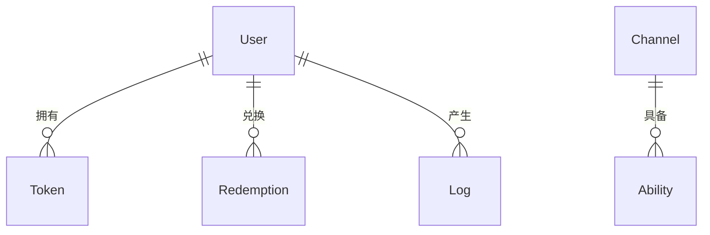

# 数据库数据模型

> One API 项目数据库模型文档，基于 GORM 自动迁移定义。

---

## 1. ER 图



**关系说明：**

- **User → Token**：一个用户可以创建多个 API 令牌，用于调用渠道接口。
- **User → Redemption**：一个用户可创建多个兑换码，兑换码被使用后为其他用户充值额度。
- **User → Log**：一个用户产生多条操作记录（消费、充值、管理等）。
- **Channel → Ability**：一个渠道可具备多个模型能力（按模型名称和用户分组组合）。

---

## 2. 各表字段详解

### users 表

| 字段 | 类型 | 约束 | 说明 |
|------|------|------|------|
| id | int | PK, auto_increment | 主键 |
| username | string | unique, index, max:12 | 登录用户名 |
| password | string | not null, min:8, max:20 | bcrypt 哈希密码 |
| display_name | string | index, max:20 | 显示名称 |
| role | int | default:1 | 角色：0=guest, 1=common_user, 10=admin, 100=root |
| status | int | default:1 | 状态：1=enabled, 2=disabled, 3=deleted |
| email | string | index, max:50 | 邮箱地址 |
| github_id | string | index | GitHub OAuth 绑定 ID |
| wechat_id | string | index | 微信 OAuth 绑定 ID |
| lark_id | string | index | 飞书 OAuth 绑定 ID |
| oidc_id | string | index | OIDC 绑定 ID |
| access_token | string | char(32), uniqueIndex | 系统管理 API 令牌 |
| quota | int64 | bigint, default:0 | 剩余额度 |
| used_quota | int64 | bigint, default:0 | 已用额度 |
| request_count | int | default:0 | 请求次数 |
| group | string | varchar(32), default:'default' | 用户分组，影响可用模型和倍率 |
| aff_code | string | varchar(32), uniqueIndex | 邀请码（4 位随机字符串） |
| inviter_id | int | index | 邀请人用户 ID |

**说明：**

- `password` 字段永远不会以明文返回，查询时默认通过 `Omit("password")` 排除。
- `access_token` 用于系统管理 API 鉴权（Bearer Token），注册时自动生成 UUID。
- `quota` 和 `used_quota` 使用 `int64`（bigint），以 `quota` 为单位（非分/元）。
- `group` 用于权限控制，用户只能使用其所在分组已配置的模型。
- `aff_code` 注册时自动生成 4 位随机字符串。

---

### channels 表

| 字段 | 类型 | 约束 | 说明 |
|------|------|------|------|
| id | int | PK, auto_increment | 主键 |
| type | int | default:0 | 渠道类型，对应不同的 API 提供商 |
| key | string | text | API 密钥（查询时默认 Omit） |
| status | int | default:1 | 状态：0=unknown, 1=enabled, 2=manually_disabled, 3=auto_disabled |
| name | string | index | 渠道名称 |
| weight | \*uint | default:0 | 权重，用于负载均衡 |
| created_time | int64 | bigint | 创建时间戳 |
| test_time | int64 | bigint | 最近测试时间戳 |
| response_time | int | - | 响应时间（毫秒） |
| base_url | \*string | default:'' | 自定义 API 地址 |
| other | \*string | text | **已废弃**，请使用 Config 字段 |
| balance | float64 | - | 账户余额（USD） |
| balance_updated_time | int64 | bigint | 余额更新时间戳 |
| models | string | - | 支持的模型列表（逗号分隔） |
| group | string | varchar(32), default:'default' | 渠道分组（逗号分隔表示多组） |
| used_quota | int64 | bigint, default:0 | 渠道已用额度 |
| model_mapping | \*string | varchar(1024), default:'' | 模型映射（JSON 格式，如 `{"gpt-3.5-turbo":"gpt-3.5-turbo-0613"}`） |
| priority | \*int64 | bigint, default:0 | 优先级，数值越高优先使用 |
| config | string | - | 渠道配置（JSON 格式），包含 region / sk / ak / api_version 等 |
| system_prompt | \*string | text | 系统提示词，发给模型的 system prompt 覆写 |

**说明：**

- `key` 字段在列表查询时默认通过 `Omit("key")` 排除。
- `other` 字段已废弃。旧数据中的额外配置已迁移至 `config` 字段。
- `model_mapping` 格式：`{"请求模型名": "渠道实际模型名"}`。
- `config` 是一个 JSON 字符串，解析为 `ChannelConfig` 结构，支持 `region`、`sk`、`ak`、`user_id`、`api_version`、`library_id`、`plugin`、`vertex_ai_project_id`、`vertex_ai_adc` 等字段。
- `Weight` 为指针类型（`*uint`），`nil` 时等效为 0。
- 状态变更时同步更新关联的 `abilities` 表。

---

### tokens 表

| 字段 | 类型 | 约束 | 说明 |
|------|------|------|------|
| id | int | PK, auto_increment | 主键 |
| user_id | int | - | 所属用户 ID，FK → users.id |
| key | string | char(48), uniqueIndex | API 令牌值 |
| status | int | default:1 | 状态：1=enabled, 2=disabled, 3=expired, 4=exhausted |
| name | string | index | 令牌名称 |
| created_time | int64 | bigint | 创建时间戳 |
| accessed_time | int64 | bigint | 最近访问时间戳 |
| expired_time | int64 | bigint, default:-1 | 过期时间戳（-1 表示永不过期） |
| remain_quota | int64 | bigint, default:0 | 剩余额度 |
| unlimited_quota | bool | default:false | 是否不限额度 |
| used_quota | int64 | bigint, default:0 | 已用额度 |
| models | \*string | text | 允许使用的模型列表（空表示全部） |
| subnet | \*string | default:'' | 允许访问的 IP 子网 CIDR |

**说明：**

- `key` 为 48 位随机字符串，格式为 `sk-` 开头。
- `expired_time = -1` 表示永不过期。系统会在每次鉴权时检查是否过期并自动标记 `status=3`。
- `unlimited_quota = true` 时，`remain_quota` 不受扣减影响。
- `subnet` 字段支持 CIDR 表示法（如 `192.168.1.0/24`），为空时不限制来源 IP。
- 注册时自动为每个用户创建一个名为 `default` 的令牌。

---

### abilities 表

渠道-模型-分组映射表。记录了每个渠道在哪些分组下支持哪些模型。

| 字段 | 类型 | 约束 | 说明 |
|------|------|------|------|
| group | string | varchar(32), PK | 用户分组名 |
| model | string | PK | 模型名称 |
| channel_id | int | PK, index | 渠道 ID，FK → channels.id |
| enabled | bool | - | 是否启用 |
| priority | \*int64 | bigint, default:0, index | 渠道优先级（冗余，用于路由快速筛选） |

**说明：**

- 三个字段 `(group, model, channel_id)` 构成联合主键，无自增 id。
- 当渠道启用/禁用时，其所有 abilities 的 `enabled` 字段同步更新。
- 当渠道的 `models` 或 `group` 更新时，先删除旧 abilities 再重新插入。
- 路由选择时，优先选择优先级最高且 `enabled = true` 的渠道，同优先级内随机选择。

---

### redemptions 表

| 字段 | 类型 | 约束 | 说明 |
|------|------|------|------|
| id | int | PK, auto_increment | 主键 |
| user_id | int | - | 创建者用户 ID（FK → users.id） |
| key | string | char(32), uniqueIndex | 兑换码 |
| status | int | default:1 | 状态：1=enabled, 2=disabled, 3=used |
| name | string | index | 兑换码名称 |
| quota | int64 | bigint, default:100 | 可兑换额度 |
| created_time | int64 | bigint | 创建时间戳 |
| redeemed_time | int64 | bigint | 兑换时间戳（被使用时记录） |

**说明：**

- `key` 为 32 位随机字符串。
- `status = 3`（已使用）后不可再次兑换。
- 兑换流程在事务中完成：校验兑换码状态 → 增加用户额度 → 更新兑换码状态。

---

### logs 表

| 字段 | 类型 | 约束 | 说明 |
|------|------|------|------|
| id | int | PK, auto_increment | 主键 |
| user_id | int | index | 用户 ID |
| created_at | int64 | bigint, index:(type, created_at) | 日志时间戳 |
| type | int | index:(type, created_at) | 日志类型：1=topup, 2=consume, 3=manage, 4=system, 5=test |
| content | string | - | 日志内容 |
| username | string | index:(username, model_name), default:'' | 用户名 |
| token_name | string | index, default:'' | 令牌名称 |
| model_name | string | index; index:(username, model_name), default:'' | 模型名称 |
| quota | int | default:0 | 消耗额度 |
| prompt_tokens | int | default:0 | 提示 tokens 数 |
| completion_tokens | int | default:0 | 补全 tokens 数 |
| channel_id | int | index | 渠道 ID |
| request_id | string | default:'' | 请求 ID（用于链路追踪） |
| elapsed_time | int64 | default:0 | 请求耗时（毫秒） |
| is_stream | bool | default:false | 是否为流式请求 |
| system_prompt_reset | bool | default:false | 系统提示词是否被重置 |

**说明：**

- `logs` 表支持独立数据库存储（通过 `LOG_SQL_DSN` 环境变量配置），避免日志数据量大时影响主库性能。
- 如果未配置 `LOG_SQL_DSN`，则日志与主库共用同一数据库。
- `quota` 字段记录实际消耗，单位与 `User.quota` 一致。
- `type = 2`（consume）的日志可通过 `LogConsumeEnabled` 配置开关是否记录。

---

### options 表

| 字段 | 类型 | 约束 | 说明 |
|------|------|------|------|
| key | string | PK | 配置键 |
| value | string | - | 配置值（JSON 字符串） |

简易键值存储表，用于存储系统运行时配置。配置项在内存中维护一个 `OptionMap`（sync.RWMutex 保护），同时持久化到数据库。

**常用配置键示例：**

| Key | 说明 |
|-----|------|
| Theme | 系统主题 |
| SystemName | 系统名称 |
| Logo | Logo 地址 |
| Footer | 页脚内容 |
| Notice | 公告内容 |
| About | 关于页面内容 |
| HomePageContent | 首页内容 |
| PasswordLoginEnabled | 是否启用密码登录 |
| RegisterEnabled | 是否开放注册 |
| ModelRatio | 模型单价倍率（JSON） |
| GroupRatio | 分组倍率（JSON） |
| CompletionRatio | 补全倍率（JSON） |
| QuotaForNewUser | 新用户注册赠送额度 |
| QuotaForInviter | 邀请者奖励额度 |
| QuotaForInvitee | 被邀请者奖励额度 |
| TopUpLink | 充值链接 |
| ChatLink | 聊天链接 |
| RetryTimes | 失败重试次数 |
| ChannelDisableThreshold | 渠道自动禁用阈值（错误率） |

**说明：**

- 使用 `GORM FirstOrCreate` 写入，`Save` 持久化。
- 支持运行时热更新，系统后台定时（频率可配置）从数据库同步配置到内存。
- 部分配置项（如 SMTP 凭据、OAuth 密钥等）仅保存在数据库中，不设默认值。

---

## 3. 状态枚举值汇总

### ChannelStatus（渠道状态）

| 值 | 常量名 | 说明 |
|----|--------|------|
| 0 | ChannelStatusUnknown | 未知状态 |
| 1 | ChannelStatusEnabled | 启用 |
| 2 | ChannelStatusManuallyDisabled | 手动禁用 |
| 3 | ChannelStatusAutoDisabled | 自动禁用（因故障率过高） |

### UserStatus（用户状态）

| 值 | 常量名 | 说明 |
|----|--------|------|
| 1 | UserStatusEnabled | 正常 |
| 2 | UserStatusDisabled | 封禁 |
| 3 | UserStatusDeleted | 已删除 |

### UserRole（用户角色）

| 值 | 常量名 | 说明 |
|----|--------|------|
| 0 | RoleGuestUser | 游客 |
| 1 | RoleCommonUser | 普通用户 |
| 10 | RoleAdminUser | 管理员 |
| 100 | RoleRootUser | 超级管理员 |

### TokenStatus（令牌状态）

| 值 | 常量名 | 说明 |
|----|--------|------|
| 1 | TokenStatusEnabled | 启用 |
| 2 | TokenStatusDisabled | 禁用 |
| 3 | TokenStatusExpired | 已过期 |
| 4 | TokenStatusExhausted | 额度耗尽 |

系统在每次令牌鉴权时会自动检查过期和额度，并更新状态。

### RedemptionStatus（兑换码状态）

| 值 | 常量名 | 说明 |
|----|--------|------|
| 1 | RedemptionCodeStatusEnabled | 可用 |
| 2 | RedemptionCodeStatusDisabled | 禁用 |
| 3 | RedemptionCodeStatusUsed | 已使用 |

### LogType（日志类型）

| 值 | 常量名 | 说明 |
|----|--------|------|
| 0 | LogTypeUnknown | 未知 |
| 1 | LogTypeTopup | 充值 |
| 2 | LogTypeConsume | 消费 |
| 3 | LogTypeManage | 管理操作 |
| 4 | LogTypeSystem | 系统操作 |
| 5 | LogTypeTest | 测试 |

---

## 4. 数据库迁移机制

One API 使用 **GORM AutoMigrate** 自动管理数据库表结构，启动时自动运行。

### 迁移顺序

在 `model/migrateDB()` 中定义，严格按以下顺序执行：

1. **Channel** — 渠道表（先迁移，因为 Ability 依赖 ChannelId）
2. **Token** — 令牌表
3. **User** — 用户表
4. **Option** — 配置表
5. **Redemption** — 兑换码表
6. **Ability** — 能力映射表
7. **Log** — 日志表
8. **Channel**（再次）— 确保所有外键/索引建立完整

### 关键逻辑

```go
func migrateDB() error {
    DB.AutoMigrate(&Channel{})
    DB.AutoMigrate(&Token{})
    DB.AutoMigrate(&User{})
    DB.AutoMigrate(&Option{})
    DB.AutoMigrate(&Redemption{})
    DB.AutoMigrate(&Ability{})
    DB.AutoMigrate(&Log{})
    DB.AutoMigrate(&Channel{}) // 二次迁移确保完整性
}
```

- **AutoMigrate** 仅会创建缺失的表和列，不会删除或修改已有列，保证数据安全。
- 仅 **Master 节点**执行迁移 (`if !config.IsMasterNode { return }`)，从节点不执行。

### 日志表独立迁移

日志表 (`logs`) 支持独立数据库存储。当配置了 `LOG_SQL_DSN` 环境变量时，系统会：

1. 连接到独立的日志数据库
2. 在独立数据库上执行 `LOG_DB.AutoMigrate(&Log{})`
3. 未配置 `LOG_SQL_DSN` 时，日志与主库共用同一数据库（`LOG_DB = DB`）

### 历史迁移脚本

对于旧版本升级，项目提供了历史 SQL 迁移脚本（适用于手动升级场景）：

| 脚本 | 说明 |
|------|------|
| `bin/migration_v0.2-v0.3.sql` | v0.2 到 v0.3 的数据库迁移 |
| `bin/migration_v0.3-v0.4.sql` | v0.3 到 v0.4 的数据库迁移 |

新版本使用 AutoMigrate 自动迁移，一般无需手动执行这些脚本。

### 初始化 Root 账户

首次启动且数据库中无用户时，系统自动创建 root 账户：

- 默认用户名：`root`
- 默认密码：`123456`
- 角色：`RoleRootUser (100)`
- 初始额度：`500000000000000`
- 可通过环境变量 `INITIAL_ROOT_TOKEN` 和 `INITIAL_ROOT_ACCESS_TOKEN` 预设初始化令牌。

---

## 5. 数据库选择建议

| 场景 | 推荐 | 原因 |
|------|------|------|
| 个人使用 / 低并发 | SQLite | 零配置，单文件部署，无需额外进程，适合开发和个人搭建 |
| 生产环境 / 高并发 | MySQL | 成熟的关系型数据库，连接池管理优秀，并发写入性能好 |
| 多机部署 | MySQL / PostgreSQL | 支持远程连接，多节点共享同一数据库，实现水平扩展 |
| 日志量大 | MySQL + LOG_SQL_DSN | 日志表可独立存储到单独的数据库实例，避免大量日志写入影响主业务库性能 |

### 连接配置

项目通过环境变量配置数据库连接：

| 环境变量 | 说明 | 默认值 |
|----------|------|--------|
| `SQL_DSN` | 主库 DSN（空则使用 SQLite） | 空 |
| `LOG_SQL_DSN` | 日志库 DSN（空则与主库共用） | 空 |
| `SQL_MAX_IDLE_CONNS` | 最大空闲连接数 | 100 |
| `SQL_MAX_OPEN_CONNS` | 最大打开连接数 | 1000 |
| `SQL_MAX_LIFETIME` | 连接最大存活时间（秒） | 60 |

### 自动检测逻辑

系统根据 `SQL_DSN` 格式自动选择数据库驱动：

- `postgres://` 开头 → **PostgreSQL**（`PreferSimpleProtocol: true` 禁用隐式预处理语句）
- 非空且非 postgres:// → **MySQL**
- 空 → **SQLite**（默认文件路径：`one-api.db`，支持 `_busy_timeout` 配置）

所有连接默认启用 `PrepareStmt: true`（预编译 SQL 以提升性能）。
