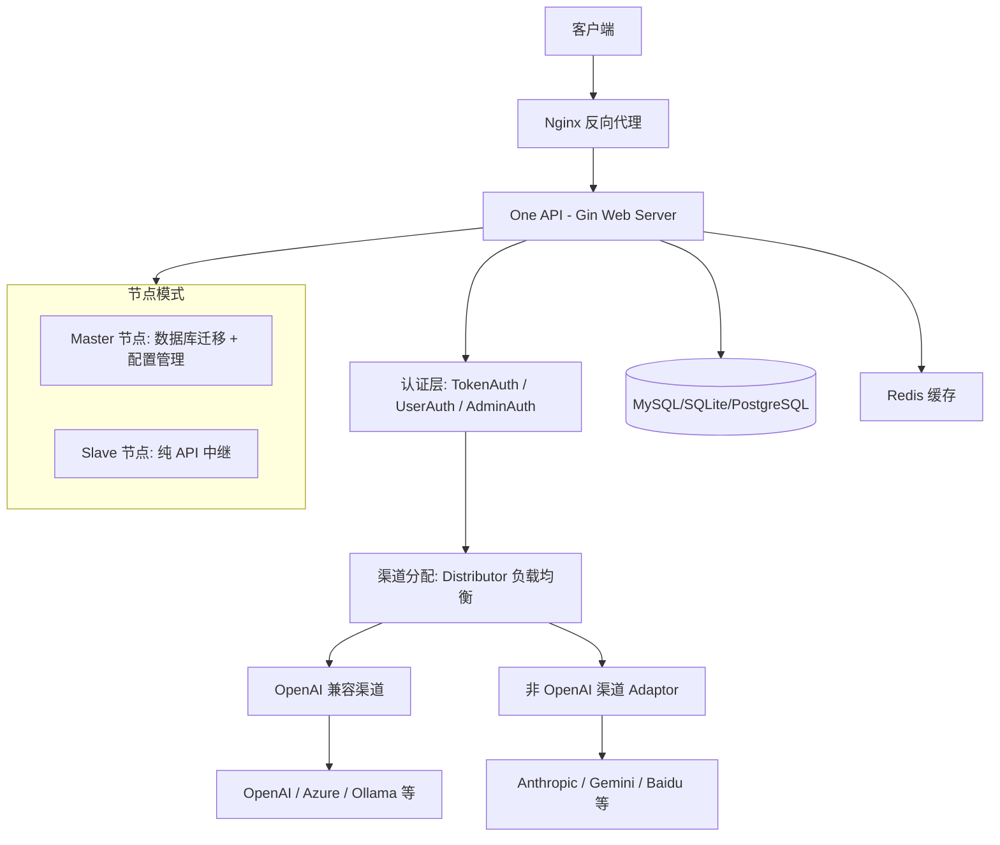

# 系统架构概览

## 1. 项目定位

One API 是一个开源的 LLM API 网关，通过标准的 OpenAI API 格式统一访问 38 个大模型提供商。它为下游应用提供统一的 API 入口，负责鉴权、负载均衡、请求中继、格式转换和额度管理。项目以 Go 语言编写，使用 Gin 框架提供高性能 HTTP 服务，通过 GORM 支持 SQLite / MySQL / PostgreSQL 三种数据库。

## 2. 整体架构



请求生命周期：

```
客户端请求
  ↓
Nginx 反向代理 (可选)
  ↓
Gin 中间件链: RequestId → Language → Logger → CORS → RateLimit
  ↓
认证中间件: TokenAuth (API 密钥) / UserAuth (Session) / AdminAuth (管理员)
  ↓
Distributor 中间件: 按分组 + 模型名选择可用渠道
  ↓
Relay Controller: 调用对应 Adaptor 转换请求 → 发送到上游 API → 转换响应
  ↓
额度结算 (Pre-consumed → Actual consumption)
  ↓
返回 OpenAI 格式响应
```

## 3. 技术栈

| 层级 | 技术 | 版本 |
|------|------|------|
| 语言 | Go | 1.20 |
| Web 框架 | Gin | 1.10.0 |
| ORM | GORM | 1.25.10 |
| 数据库 | SQLite / MySQL / PostgreSQL | — |
| 缓存 | Redis (可选) | 8.x |
| 前端 | React (default / berry / air 主题) | — |

## 4. 目录结构一览

```
one-api/
  main.go                     # 程序入口：初始化组件、组装中间件、注册路由、启动 HTTP 服务
  common/                     # 共享基础设施层
    init.go                   # 命令行参数解析、日志目录创建、全局配置初始化
    config/config.go          # 全部配置常量与运行时变量（鉴权开关、限流参数、缓存策略等）
    client/init.go            # HTTP 客户端初始化（连接池、超时、代理）
    logger/                   # 日志系统（文件轮转、分级输出、同步/异步模式）
    i18n/i18n.go              # 国际化支持（多语言消息加载）
    helper/                   # 通用工具函数（时间戳、密钥生成等）
    network/ip.go             # IP 地址解析工具
    constants.go              # 全局常量（版本号、SQLite 路径等）
    database.go               # GORM 数据库类型标记
    redis.go                  # Redis 客户端初始化
    rate-limit.go             # 令牌桶限流器
    ctxkey/key.go             # Gin context 键名定义
    ...
  model/                      # 数据模型与数据库操作层
    main.go                   # DB 初始化、AutoMigrate 数据库迁移（按固定顺序执行）
    channel.go                # 渠道模型（CRUD、缓存加载、随机选择可用渠道）
    token.go                  # Token 模型（生成、校验、额度扣减）
    user.go                   # 用户模型
    log.go                    # 请求日志模型
    option.go                 # 系统配置项（OptionMap 缓存）
    ability.go                # 渠道能力模型（模型名 → 渠道映射）
    redemption.go             # 兑换码模型
    cache.go                  # 内存缓存操作
  controller/                 # HTTP 请求处理函数（业务逻辑层）
    channel.go                # 渠道管理 API
    token.go                  # Token 管理 API
    user.go                   # 用户管理 API
    log.go                    # 日志查询 API
    option.go                 # 系统配置 API
    ...
  middleware/                 # Gin 中间件
    auth.go                   # 认证中间件（TokenAuth / UserAuth / AdminAuth）
    distributor.go            # 渠道分发中间件（按分组权重选择渠道）
    cors.go                   # CORS 跨域中间件
    rate-limit.go             # 限流中间件（API / Web / Upload / Download）
    cache.go                  # 缓存中间件
    language.go               # 语言检测中间件
    logger.go                 # 请求日志中间件
    request-id.go             # 请求 ID 注入中间件
    turnstile-check.go        # Turnstile 验证码校验
    gzip.go                   # Gzip 压缩
    recover.go                # 全局 panic 恢复
    utils.go                  # 中间件通用工具函数
  router/                     # 路由注册
    main.go                   # 路由入口：组合 API / Dashboard / Relay / Web 四组路由
    api.go                    # API 管理路由（管理后台接口）
    dashboard.go              # Dashboard 路由（统计数据）
    relay.go                  # 中继路由（/v1/* 代理端点）
    web.go                    # 前端静态文件路由或重定向
  relay/                      # 请求中继核心
    adaptor/                  # 38 个渠道适配器实现
      interface.go            # Adaptor 接口定义（9 个方法）
      common.go               # 适配器通用工具（请求头设置、HTTP 请求辅助函数）
      openai/                 # OpenAI 兼容渠道适配器
      anthropic/              # Anthropic Claude 适配器
      gemini/                 # Google Gemini 适配器
      azure/                  # (via openai 适配器或独立)
      baidu/                  # 百度文心一言适配器
      zhipu/                  # 智谱 ChatGLM 适配器
      ali/                    # 阿里通义千问适配器
      xunfei/                 # 讯飞星火适配器
      doubao/                 # 字节豆包适配器
      deepseek/               # DeepSeek 适配器
      ollama/                 # Ollama (本地模型) 适配器
      aws/                    # AWS Bedrock 适配器 (Claude)
      vertexai/               # Google Vertex AI 适配器
      ...                     # 其他渠道适配器
    channeltype/              # 渠道类型常量定义与注册
      define.go               # 57 个渠道类型枚举常量
      helper.go               # 渠道类型辅助函数
      url.go                  # 渠道 BaseURL 映射
    controller/               # 中继模式处理器
    relaymode/                # 中继模式常量（ChatCompletion / Completions / Embeddings / Images / Audio / Edits / Moderations）
    meta/                     # 请求元数据结构体 (RelayMeta)
    model/                    # OpenAI 兼容请求/响应模型定义
  web/                        # React 前端
    default/                  # default 主题
    berry/                    # berry 主题
    air/                      # air 主题
  docs/                       # 项目文档
  bin/                        # 历史数据库迁移脚本
```

## 5. 核心设计决策

### Adaptor 接口统一渠道差异

定义在 `relay/adaptor/interface.go` 中的 `Adaptor` 接口包含 9 个方法：

```go
type Adaptor interface {
    Init(meta *meta.Meta)
    GetRequestURL(meta *meta.Meta) (string, error)
    SetupRequestHeader(c *gin.Context, req *http.Request, meta *meta.Meta) error
    ConvertRequest(c *gin.Context, relayMode int, request *model.GeneralOpenAIRequest) (any, error)
    ConvertImageRequest(request *model.ImageRequest) (any, error)
    DoRequest(c *gin.Context, meta *meta.Meta, requestBody io.Reader) (*http.Response, error)
    DoResponse(c *gin.Context, resp *http.Response, meta *meta.Meta) (usage *model.Usage, err *model.ErrorWithStatusCode)
    GetModelList() []string
    GetChannelName() string
}
```

每个新渠道只需实现这 9 个方法即可接入系统。`ConvertRequest` 将 OpenAI 格式的标准请求转换为目标厂商的私有格式，`DoResponse` 则将厂商响应转换回 OpenAI 格式。`DoRequestHelper` (在 `common.go` 中) 封装了请求发送的通用流程：构造 URL → 设置请求头 → 发送 HTTP 请求。渠道差异被完全封装在接口实现中，路由层和额度计算层无需感知具体渠道。

### 渠道分配在中间件层

分发器 (`middleware/distributor.go`) 在鉴权之后、业务处理之前执行。执行流程：

1. 从已认证的 Token 中提取用户分组 (`userGroup`)
2. 从请求体中解析模型名 (`requestModel`)
3. 调用 `model.CacheGetRandomSatisfiedChannel(userGroup, requestModel)` 从缓存中按权重随机选择一个可用渠道
4. 将选定渠道的类型、ID、名称、密钥、BaseURL 等信息注入 Gin Context
5. 支持渠道级别跳过分发（指定 `specific channel id` 直接使用指定渠道）

这一设计使业务处理函数（Relay Controller）拿到的是已选定且配置完整的渠道，职责单一，无需关心选择逻辑。

### Master / Slave 节点分离

通过 `NODE_TYPE` 环境变量控制节点角色：

- **Master 节点**（`NODE_TYPE` 未设置或不为 `"slave"`）：负责数据库迁移（AutoMigrate）、配置管理、频道缓存加载，提供管理后台和 API 中继
- **Slave 节点**（`NODE_TYPE=slave`）：跳过数据库迁移，仅处理 API 中继请求。通过 Redis 订阅配置变更，实现配置同步

判断逻辑在 `common/config/config.go` 中：

```go
var IsMasterNode = os.Getenv("NODE_TYPE") != "slave"
```

Slave 节点通过 `model.InitDB()` 中的判断跳过迁移：

```go
if !config.IsMasterNode {
    return
}
```

这种架构支持水平扩展：部署一个 Master 节点管理配置，多个 Slave 节点分担 API 中继流量。

### GORM AutoMigrate 数据库版本管理

数据库迁移绑定在启动流程的 `model.migrateDB()` 中，按固定顺序执行 AutoMigrate：

```
Channel → Token → User → Option → Redemption → Ability → Log
```

支持三种数据库驱动：

- **SQLite**：默认方案，无需外部依赖，适合开发和小规模部署
- **MySQL**：通过 `SQL_DSN` 环境变量设定 DSN
- **PostgreSQL**：DSN 以 `postgres://` 前缀自动识别

日志表支持独立数据库 (`LOG_SQL_DSN`)，可将日志存储到单独的数据库实例中，减轻主库写入压力。

### 额度管理系统

采用预扣 + 实际结算的两阶段模式：

1. **预扣额度** (`PreConsumedQuota`)：请求开始时按估计 Token 数预扣，防止并发超用
2. **实际结算**：请求完成后根据实际 Token 用量（从 `DoResponse` 返回值获取）进行差值调整
3. **批量更新** (`BATCH_UPDATE_ENABLED`)：将额度变更批量写入数据库，减少写入频率

### 二级日志存储

支持将请求日志 (`logs` 表) 存储到独立的数据库实例中 (`LOG_SQL_DSN`)。当设置 `LOG_SQL_DSN` 时，日志表会创建在独立数据库中；否则与主表共用同一数据库。这解决了高流量场景下日志写入对主库的性能影响。

## 6. 关键外部依赖

| 依赖 | 用途 |
|------|------|
| `github.com/gin-gonic/gin` | HTTP Web 框架 |
| `github.com/gin-contrib/sessions` | Session 管理 |
| `github.com/gin-contrib/cors` | CORS 中间件 |
| `github.com/gin-contrib/gzip` | Gzip 压缩 |
| `gorm.io/gorm` | ORM 框架 |
| `gorm.io/driver/mysql` | MySQL 驱动 |
| `gorm.io/driver/sqlite` | SQLite 驱动 |
| `gorm.io/driver/postgres` | PostgreSQL 驱动 |
| `github.com/go-redis/redis/v8` | Redis 客户端（可选缓存 + 配置同步） |
| `github.com/golang-jwt/jwt` | JWT Token 签发与验证 |
| `github.com/google/uuid` | UUID 生成 |
| `github.com/pkoukk/tiktoken-go` | Token 计数（tiktoken Go 移植版） |
| `github.com/gorilla/websocket` | WebSocket 支持 |
| `github.com/joho/godotenv` | `.env` 环境变量文件加载 |
| `github.com/patrickmn/go-cache` | 内存缓存 |
| `github.com/aws/aws-sdk-go-v2` | AWS Bedrock 集成 |
| `google.golang.org/api` | Google API (Gemini / Vertex AI) |
| `golang.org/x/crypto` | 密码哈希与加密 |
| `golang.org/x/sync` | 并发原语（errgroup 等） |
