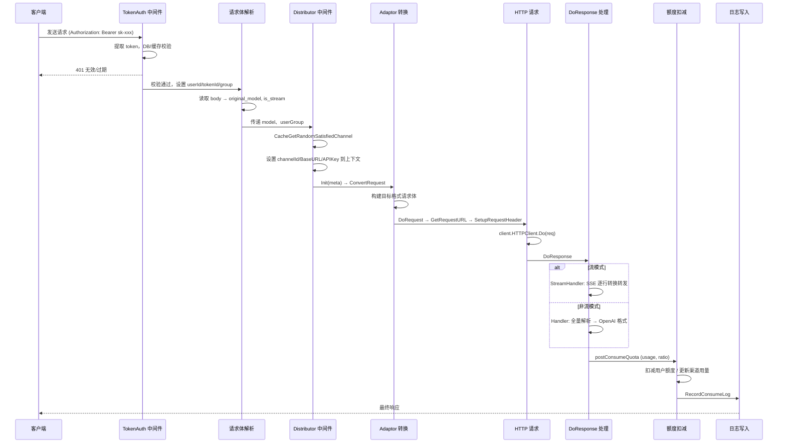
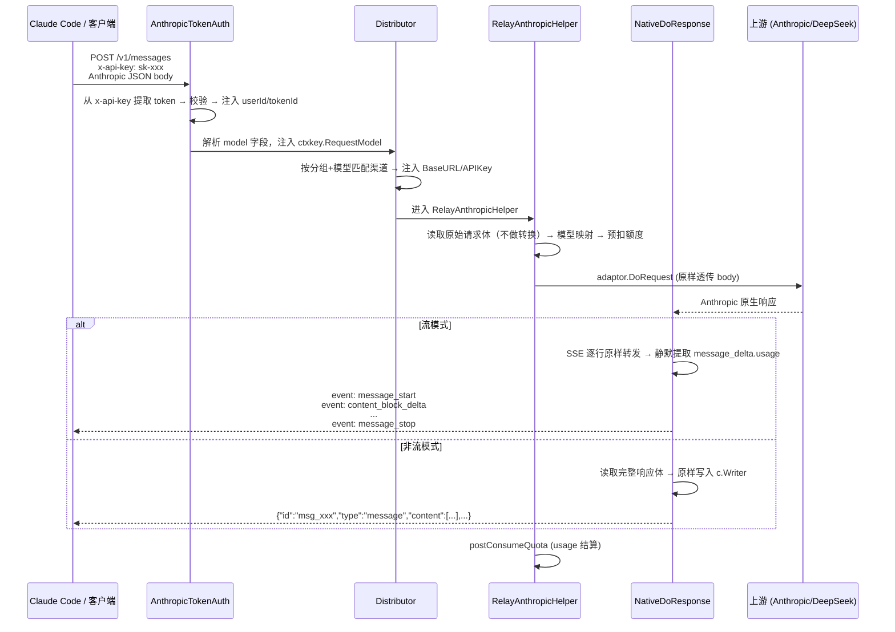
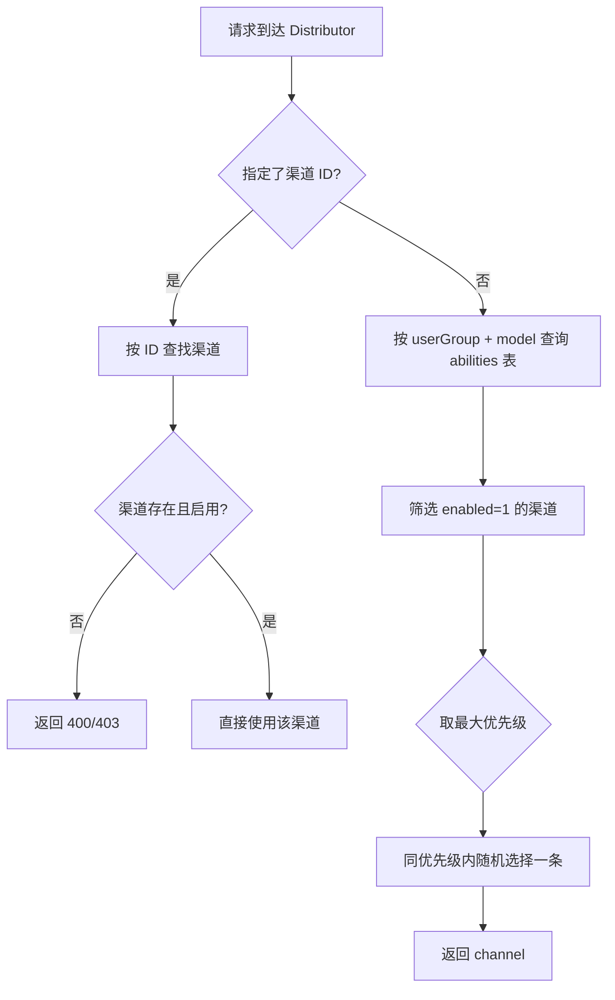
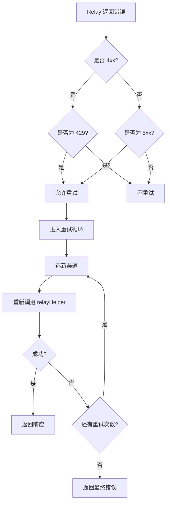
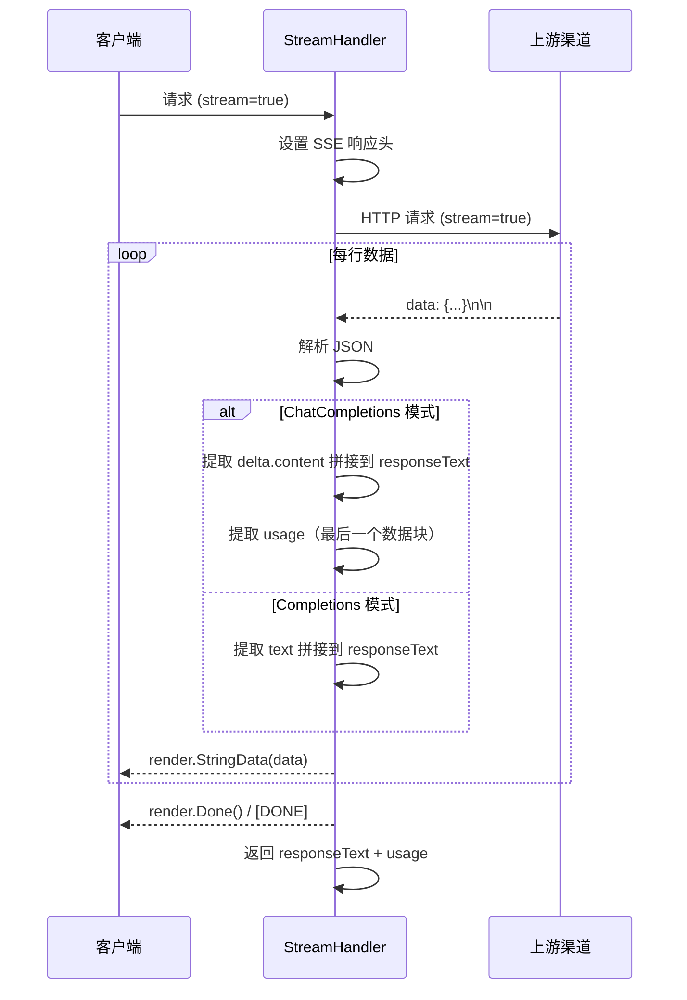
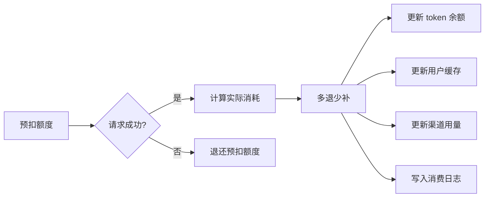

# Relay 中继系统

> One API 的核心请求中继引擎，负责将客户端请求透明转发到各类 AI 渠道，完成协议转换、负载均衡、重试、额度扣减和日志记录。

---

## 1. 请求生命周期

一次完整的 Relay 请求经过以下链路：



---

## 2. 八步详解

### (1) Token 鉴权

**文件**: `middleware/auth.go:91` `TokenAuth`

- 从 `Authorization: Bearer sk-xxx` 中提取 token 值
- 去除 `sk-` 前缀后调用 `model.ValidateUserToken(key)` 验证
- 验证通过后向 gin.Context 注入以下字段：
  - `ctxkey.Id` → userId
  - `ctxkey.TokenId` → tokenId
  - `ctxkey.TokenName` → tokenName（日志用）
  - `ctxkey.RequestModel` → 请求中的模型名
  - `ctxkey.AvailableModels` → token 限制的模型列表（若有）
- 检查子网限制（`token.Subnet`），若不在允许网段则 403
- 检查用户是否被封禁，若被封禁则 403
- token 的 `sk-xxx-channelId` 格式可指定具体渠道（仅管理员）

### (2) 请求体解析

**文件**: `middleware/utils.go:23` `getRequestModel` / `relay/controller/helper.go:29` `getAndValidateTextRequest`

- 中间件 `getRequestModel` 初次读取 body，提取 `model` 字段存入 `ctxkey.RequestModel`（即 `original_model`），用于后续渠道分配
- 在 `RelayTextHelper` 中再次解析为完整的 `GeneralOpenAIRequest`，获取 `stream` 字段 → `meta.IsStream`
- 使用 `common.UnmarshalBodyReusable` 确保 body 可重复读取，为重试保留原始请求体

### (3) 渠道分配 (Distributor)

详见下文第 5 节《负载均衡算法》。

### (4) Adaptor 请求转换

**文件**: `relay/controller/text.go:55-65`

```go
adaptor := relay.GetAdaptor(meta.APIType)   // 获取适配器实例
adaptor.Init(meta)                            // 设置渠道类型
requestBody, err := getRequestBody(c, meta, textRequest, adaptor)
```

`getRequestBody` (text.go:90) 的逻辑：

- **OpenAI 直通优化路径**：如果 `APIType == OpenAI` 且模型名未映射、无系统提示改写，直接用 `c.Request.Body`，跳过序列化
- **转换路径**：调用 `adaptor.ConvertRequest(c, relayMode, textRequest)`，将 OpenAI 格式的请求转为渠道自有格式，再 `json.Marshal` 得到 `io.Reader`

### (5) HTTP 请求

**文件**: `relay/adaptor/common.go:21-38` `DoRequestHelper` / `common/client/init.go`

`DoRequestHelper` 执行三步：

1. `a.GetRequestURL(meta)` — 构造目标 URL
2. `http.NewRequest(method, url, body)` — 创建 HTTP 请求
3. `a.SetupRequestHeader(c, req, meta)` — 设置鉴权与 Content-Type 头

最终通过 `client.HTTPClient.Do(req)` 发出请求。

HTTP 客户端配置（`common/client/init.go`）：

- 超时：`RELAY_TIMEOUT` 环境变量（秒），0 表示不设超时
- 代理：`RELAY_PROXY` 环境变量，设置后所有 API 请求经过代理

### (6) DoResponse 转换

**文件**: `relay/adaptor/openai/main.go`

**非流模式** (`Handler`, main.go:99)：

- 读取完整响应体，解析为 `SlimTextResponse`
- 检查 `textResponse.Error` 是否有上游错误，有则直接返回
- 将原始响应头 + 响应体复制到 `c.Writer`，透传给客户端
- 提取 `Usage`（prompt_tokens / completion_tokens / total_tokens）
- 如果 usage 为空（某些渠道不返回），使用 tiktoken 估算 token 数

**流模式** (`StreamHandler`, main.go:27)：

- 设置 SSE 响应头：`Content-Type: text/event-stream`
- `bufio.Scanner` 逐行读取 `data: {...}\n\n`
- 每行实时 `render.StringData(c, data)` 转发给客户端
- 收集 responseText 和 usage（从 `stream_options.include_usage` 返回的最后一个数据块中提取）
- 若上游未返回 usage，调用 `ResponseText2Usage` 估算

**错误处理** (`relay/controller/error.go:55` `RelayErrorHandler`)：

- 将上游返回的错误响应转为 OpenAI 标准错误格式
- 非 2xx 响应：构造 `upstream_error` 类型错误
- 响应体为 nil：返回 500 + `bad_response`

### (7) 额度扣减

**文件**: `relay/controller/helper.go:97` `postConsumeQuota`

执行过程：

1. 计算实际消耗额度：`quota = ceil((promptTokens + completionTokens * completionRatio) * ratio)`
2. 计算差额：`quotaDelta = quota - preConsumedQuota`
3. `model.PostConsumeTokenQuota(tokenId, quotaDelta)` — 更新 token 剩余额度
4. `model.CacheUpdateUserQuota(userId)` — 刷新用户额度缓存
5. `model.UpdateUserUsedQuotaAndRequestCount(userId, quota)` — 更新用户总用量
6. `model.UpdateChannelUsedQuota(channelId, quota)` — 更新渠道总用量

额度扣减和渠道用量更新均支持批量更新模式（`BATCH_UPDATE_ENABLED`），在高并发场景下将更新操作暂存后批量写入。

**预扣机制**（`preConsumeQuota`, helper.go:68）：

- 请求发起前按 ` (PreConsumedQuota + promptTokens + maxTokens) * ratio ` 预扣额度
- 若用户余额远大于预扣值（`userQuota > 100 * preConsumedQuota`），则将预扣值置 0（信任模式）
- 请求失败时调用 `billing.ReturnPreConsumedQuota` 退还预扣额度

### (8) 日志写入

**文件**: `model/log.go:80` `RecordConsumeLog`

日志记录到 `LOG_DB`（可通过 `LOG_SQL_DSN` 配置独立数据库，与主业务库分离）。

记录字段：

| 字段 | 来源 |
|------|------|
| user_id | meta.UserId |
| channel_id | meta.ChannelId |
| model_name | textRequest.Model |
| prompt_tokens | usage.PromptTokens |
| completion_tokens | usage.CompletionTokens |
| quota | 实际消耗额度 |
| token_name | meta.TokenName |
| content | 倍率信息（modelRatio x groupRatio x completionRatio） |
| request_id | helper.GetRequestID |
| elapsed_time | helper.CalcElapsedTime(meta.StartTime) |
| is_stream | meta.IsStream |
| type | LogTypeConsume (2) |

日志开关由 `LogConsumeEnabled` 控制。

---

## 3. Adaptor 接口详解

**文件**: `relay/adaptor/interface.go:11`

```go
type Adaptor interface {
    Init(meta *meta.Meta)
    GetRequestURL(meta *meta.Meta) (string, error)
    SetupRequestHeader(c *gin.Context, req *http.Request, meta *meta.Meta) error
    ConvertRequest(c *gin.Context, relayMode int, request *model.GeneralOpenAIRequest) (any, error)
    ConvertImageRequest(request *model.ImageRequest) (any, error)
    DoRequest(c *gin.Context, meta *meta.Meta, requestBody io.Reader) (*http.Response, error)
    DoResponse(c *gin.Context, resp *http.Response, meta *meta.Meta) (usage *model.Usage, err *model.ErrorWithStatusCode)
    GetModelList() []string
    GetChannelName() string
}
```

### 方法详细说明

| 方法 | 参数 | 返回值 | 职责 | 调用位置 |
|------|------|--------|------|---------|
| `Init` | `meta *meta.Meta` | — | 保存渠道元信息（ChannelType、BaseURL 等） | relay controller |
| `GetRequestURL` | `meta *meta.Meta` | `(string, error)` | 根据 relay mode 和渠道类型构造完整请求 URL | `DoRequestHelper` |
| `SetupRequestHeader` | `c, req, meta` | `error` | 设置 Authorization、Content-Type 等请求头 | `DoRequestHelper` |
| `ConvertRequest` | `c, mode, request` | `(any, error)` | 将 OpenAI 通用格式转为渠道自有格式 | relay text/audio controller |
| `ConvertImageRequest` | `request *ImageRequest` | `(any, error)` | OpenAI 图片请求 → 渠道图片格式 | relay image controller |
| `DoRequest` | `c, meta, body` | `(*http.Response, error)` | 发起 HTTP 请求；默认实现委托给 `DoRequestHelper` | relay controller |
| `DoResponse` | `c, resp, meta` | `(*Usage, *ErrorWithStatusCode)` | 解析渠道响应 → OpenAI 标准格式 + 提取 usage | relay controller |
| `GetModelList` | — | `[]string` | 返回该适配器支持的模型列表 | 渠道注册 |
| `GetChannelName` | — | `string` | 返回渠道的人类可读名称 | 渠道注册 |

### 通用辅助函数

**文件**: `relay/adaptor/common.go`

- `SetupCommonRequestHeader(c, req, meta)` — 设置 Content-Type、Accept 等通用请求头；流模式下自动添加 `Accept: text/event-stream`
- `DoRequestHelper(a, c, meta, requestBody)` — 标准 DoRequest 实现：GetRequestURL → NewRequest → SetupRequestHeader → DoRequest
- `DoRequest(c, req)` — 实际执行 `client.HTTPClient.Do(req)`

### 适配器注册中心

**文件**: `relay/adaptor.go:27` `GetAdaptor`

根据 `apiType` 返回对应适配器实例：

| APIType | 适配器 |
|---------|--------|
| OpenAI | `&openai.Adaptor{}` |
| Anthropic | `&anthropic.Adaptor{}` |
| Gemini | `&gemini.Adaptor{}` |
| Baidu | `&baidu.Adaptor{}` |
| Ali | `&ali.Adaptor{}` |
| Xunfei | `&xunfei.Adaptor{}` |
| Tencent | `&tencent.Adaptor{}` |
| Zhipu | `&zhipu.Adaptor{}` |
| Coze | `&coze.Adaptor{}` |
| Cohere | `&cohere.Adaptor{}` |
| Cloudflare | `&cloudflare.Adaptor{}` |
| DeepL | `&deepl.Adaptor{}` |
| Ollama | `&ollama.Adaptor{}` |
| PaLM | `&palm.Adaptor{}` |
| Replicate | `&replicate.Adaptor{}` |
| AWS Claude | `&aws.Adaptor{}` |
| VertexAI | `&vertexai.Adaptor{}` |
| AIProxy | `&aiproxy.Adaptor{}` |
| Proxy | `&proxy.Adaptor{}` |

---

## 4. Anthropic Messages API 原生中继

One API 支持一条**独立的原生 Anthropic Messages API 中继管道**，与 OpenAI 管道完全隔离：

```
OpenAI 管道   : 客户端 --OpenAI格式--> OneAPI --[adaptor转换]--> 上游
Anthropic 管道: Claude Code --Anthropic原生--> OneAPI --[原样透传]--> 上游 Anthropic 兼容端点
```

### 核心设计原则

- **零格式转换**：请求体和响应体完全不转换，仅原样透传，杜绝语义损耗
- **共享基础设施**：复用 Token 鉴权 (`ValidateUserToken`)、渠道分发 (`Distribute`)、额度计费系统
- **独立认证**：使用 `x-api-key` 头替代 `Authorization: Bearer`
- **原生响应**：SSE 事件和 JSON 响应原样转发，仅静默提取 usage 用于记账

### 请求流程



### 涉及文件

| 文件 | 层级 | 职责 |
|------|------|------|
| `relay/relaymode/define.go` | 常量 | `AnthropicMessages` relay mode 常量 |
| `relay/relaymode/helper.go` | 辅助 | `/v1/messages` 路径映射 |
| `middleware/auth.go` | 中间件 | `AnthropicTokenAuth` (x-api-key 认证) + `FlexibleTokenAuth` (Bearer / x-api-key 双认证，用于 models 端点) |
| `router/relay.go` | 路由 | `/v1/messages` 路由组注册 |
| `relay/controller/anthropic.go` | 控制器 | `RelayAnthropicHelper` — 中继调度 + 预扣/结算 |
| `relay/adaptor/anthropic/native.go` | 适配器 | `NativeHandler` / `NativeStreamHandler` — 原生透传响应处理 |
| `controller/relay.go` | 入口 | `RelayAnthropic` 入口函数 + `relayHelper` 分支 |
| `controller/model.go` | 模型列表 | `ListModels` / `RetrieveModel` 支持 Anthropic 格式输出 |

### 模型列表端点

`GET /v1/models` 使用 `FlexibleTokenAuth` 中间件，同时支持两种认证方式，并根据请求类型返回对应格式：

| 认证方式 | 请求头 | 返回格式 | 示例 |
|---------|--------|---------|------|
| Anthropic | `x-api-key: sk-xxx` | Anthropic 格式 | `{"data":[{"id":"...","type":"model",...}],"has_more":false}` |
| OpenAI | `Authorization: Bearer sk-xxx` | OpenAI 格式 | `{"object":"list","data":[...]}` |

### 使用示例

```bash
# 非流式请求
curl -X POST http://localhost:3000/v1/messages \
  -H "x-api-key: sk-your-token" \
  -H "Content-Type: application/json" \
  -d '{"model":"claude-sonnet-4-20250514","max_tokens":128,"messages":[{"role":"user","content":[{"type":"text","text":"Hello"}]}]}'

# 流式请求
curl -N -X POST http://localhost:3000/v1/messages \
  -H "x-api-key: sk-your-token" \
  -H "Content-Type: application/json" \
  -d '{"model":"claude-sonnet-4-20250514","max_tokens":128,"messages":[{"role":"user","content":[{"type":"text","text":"Hello"}]}],"stream":true}'
```

### Claude Code 接入

```bash
export ANTHROPIC_BASE_URL="http://your-one-api-host:3000"
export ANTHROPIC_API_KEY="sk-your-one-api-token"
```

或配置 `~/.claude/settings.json`：

```json
{
  "env": {
    "ANTHROPIC_BASE_URL": "http://your-one-api-host:3000",
    "ANTHROPIC_API_KEY": "sk-your-one-api-token"
  }
}
```

---

## 5. 两种渠道模式

### OpenAI 兼容直通

适用于 API 格式与 OpenAI 高度一致的渠道。请求体无需转换，仅调整 URL 和鉴权头。

**实现**: `relay/adaptor/openai/adaptor.go`

涵盖的渠道类型：
OpenAI、Azure、Ollama、Groq、OpenRouter、DeepSeek、Moonshot、SiliconFlow、Novita 等。

关键行为：
- `ConvertRequest`：原样返回请求体，非流模式不做改动；流模式强制注入 `stream_options.include_usage = true`
- `GetRequestURL`：按渠道类型拼接不同格式的 URL（Azure 使用 `openai/deployments/{model}` 路径，其余渠道使用标准 `/v1/...` 路径）
- `SetupRequestHeader`：设置 `Authorization: Bearer {apiKey}`；Azure 使用 `api-key` 头；OpenRouter 额外注入 `HTTP-Referer` 和 `X-Title`

### 非 OpenAI 格式适配

适用于 API 格式与 OpenAI 差异较大的渠道。需要完整的双向协议转换。

每个渠道拥有独立的适配器包：`relay/adaptor/<provider>/`。

典型代表：
- **Anthropic**：`relay/adaptor/anthropic/` — Messages API ↔ ChatCompletion 转换
- **Gemini**：`relay/adaptor/gemini/` — GenerateContent ↔ ChatCompletion 转换
- **Baidu**：`relay/adaptor/baidu/` — ERNIE Bot API 转换
- **Ali（通义千问）**：`relay/adaptor/ali/` — DashScope API 转换
- **Xunfei（讯飞星火）**：`relay/adaptor/xunfei/` — WebSocket 协议适配

---

## 6. 负载均衡算法

### 核心函数

- 缓存版本：`model/cache.go:227` `CacheGetRandomSatisfiedChannel(group, model, ignoreFirstPriority)`
- 直接 DB 版本：`model/ability.go:22` `GetRandomSatisfiedChannel(group, model, ignoreFirstPriority)`

### 选择流程



### 筛选条件

1. **用户分组匹配**：只选择 `ability.group` 等于用户所在分组的渠道
2. **模型可用性**：只选择 abilities 表中有对应 `model` 记录的渠道
3. **启用状态**：只选择 `ability.enabled = true` 的渠道

### 权重 / 优先级

- 每条渠道（以及对应的 ability 记录）有 `priority` 字段
- 选择时取当前分组 + 模型下的 **最高优先级** 的所有渠道
- 在同优先级内使用 `RAND()`（MySQL）或 `RANDOM()`（SQLite/PostgreSQL）随机选择一条
- 更高 `priority` = 更优先被选中（数值越大优先级越高）

### 缓存机制

- `MemoryCacheEnabled` 开启后，`group -> model -> channels` 的映射缓存在内存中
- 每 `SYNC_FREQUENCY` 秒从数据库同步刷新
- 缓存中随机选择逻辑：取最高优先级区间内的随机索引；若启用 `ignoreFirstPriority` 且存在多个优先级，则从次优先级区间随机选

### 重试时的渠道选择

- 首次重试时调用 `CacheGetRandomSatisfiedChannel(group, model, true)`（`ignoreFirstPriority = true`）
- `ignoreFirstPriority = true` 的效果：
  - **DB 版**：跳过最高优先级，从剩余渠道中随机选
  - **缓存版**：若有多个优先级层级，从第二优先级及以下的层中随机选
- 避免连续两次选到同一条失败渠道（代码中有 `channel.Id == lastFailedChannelId` 的防重复检查）

---

## 7. 失败重试机制

### 位置

**文件**: `controller/relay.go:45` `Relay`

### 重试规则



具体规则（`controller/relay.go:105` `shouldRetry`）：

| 状态码 | 是否重试 | 说明 |
|--------|---------|------|
| 2xx | 否 | 成功 |
| 400 (Bad Request) | 否 | 请求问题，重试无意义 |
| 429 (Too Many Requests) | 是 | 限流，换渠道重试 |
| 5xx | 是 | 服务端错误，换渠道重试 |
| 其他 | 是 | 兜底，允许重试 |
| 指定了 SpecificChannelId | 否 | 用户显式指定渠道时禁用重试 |

### 配置

- 最大重试次数：`config.RetryTimes`（通过系统设置中的选项配置，非环境变量），默认 0 表示不重试

### 实现细节

```go
// controller/relay.go:70-91
for i := retryTimes; i > 0; i-- {
    channel, err := model.CacheGetRandomSatisfiedChannel(group, originalModel, i != retryTimes)
    // ...
    if channel.Id == lastFailedChannelId {
        continue  // 避免选到同一条
    }
    middleware.SetupContextForSelectedChannel(c, channel, originalModel)
    requestBody, _ := common.GetRequestBody(c)
    c.Request.Body = io.NopCloser(bytes.NewBuffer(requestBody))
    bizErr = relayHelper(c, relayMode)
    // ...
}
```

- 原始请求体通过 `common.UnmarshalBodyReusable` 保存，每次重试从 buffer 重新读取
- 重试时使用 `originalModel`（用户原始输入的模型名），不做二次模型映射
- 每次重试失败后异步调用 `processChannelRelayError` 记录错误并触发渠道监控
- 所有重试均失败时，429 错误会显示中文提示："当前分组上游负载已饱和，请稍后再试"
- 最终错误信息会附加 requestId 便于排查

---

## 8. Stream 模式处理

### SSE 协议

- 响应头：`Content-Type: text/event-stream`
- 数据格式：`data: {"choices": [...], "usage": {...}}\n\n`
- 结束标记：`data: [DONE]\n\n`

### 处理流程

**文件**: `relay/adaptor/openai/main.go:27` `StreamHandler`



### 关键细节

- `stream_options.include_usage` 在 `openai.Adaptor.ConvertRequest` (adaptor.go:84) 中强制设为 `true`
- 对于不返回 usage 的上游渠道，`DoResponse` (adaptor.go:109) 中 fallback 调用 `ResponseText2Usage` 使用 tiktoken 估算
- 估算公式：`PromptTokens` 使用预估值，`CompletionTokens = CountTokenText(responseText)`，`TotalTokens = PromptTokens + CompletionTokens`

---

## 9. 额度消费公式

### 完整公式

```
consumed_quota = ceil(
    (prompt_tokens + completion_tokens × completion_ratio)
    × group_ratio
    × model_ratio
)
```

其中各变量的含义与来源：

| 变量 | 含义 | 获取函数 | 说明 |
|------|------|---------|------|
| `prompt_tokens` | 输入 token 数 | `usage.PromptTokens` | 上游返回的实际值 |
| `completion_tokens` | 输出 token 数 | `usage.CompletionTokens` | 上游返回的实际值 |
| `completion_ratio` | 输出倍率 | `billingratio.GetCompletionRatio` | 如 GPT-3.5 为 1.33，GPT-4 为 2 |
| `group_ratio` | 分组倍率 | `billingratio.GetGroupRatio` | 用户分组倍率 × 渠道分组倍率 |
| `model_ratio` | 模型倍率 | `billingratio.GetModelRatio` | 每个模型独立的倍率系数 |

### 分组倍率

**文件**: `relay/billing/ratio/group.go`

默认分组 `default`、`vip`、`svip` 倍率均为 1，可通过系统选项动态调整。

### 模型倍率

**文件**: `relay/billing/ratio/model.go`

每个模型/渠道组合有独立的倍率系数。对于带有 `-internet` 后缀的模型（如 `qwen-max-internet`），自动去除后缀再进行匹配。

### 输出倍率 (Completion Ratio)

**文件**: `relay/billing/ratio/model.go:725` `GetCompletionRatio`

对照 OpenAI 定价策略：

| 模型 | completion_ratio | 说明 |
|------|-----------------|------|
| GPT-3.5 | 1.33 | 输出价格约为输入的 1.33 倍 |
| GPT-4 | 2 | 输出价格为输入的 2 倍 |
| 其他 | 1 | 默认输出价格与输入相同 |

### 预扣与实扣流程



1. **预扣**：请求前按 `(PreConsumedQuota + promptTokens + maxTokens) × ratio` 预扣
2. **信任模式**：若用户余额远超预扣值（> 100 倍），则不实际预扣
3. **实扣**：请求成功后按实际 usage 计算最终额度
4. **退还**：请求失败或预扣多于实扣时，调用 `PostConsumeTokenQuota(quotaDelta)` 退还差额
