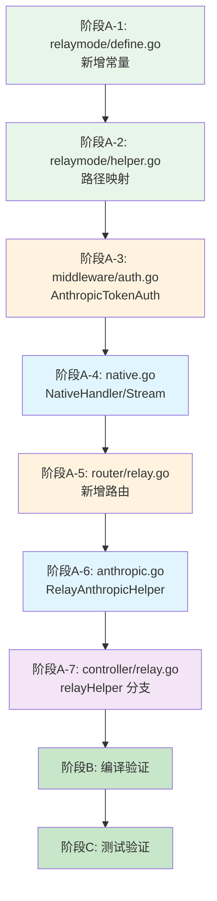

# 实施计划：入站 Anthropic Messages API 原生中继

## 1. 架构设计

### 1.1 文件清单

| 文件 | 所属层 | 改动性质 | 说明 |
|------|--------|----------|------|
| `relay/relaymode/define.go` | Go 常量 | 修改 | 新增 `AnthropicMessages` relay mode 常量 (值=16) |
| `relay/relaymode/helper.go` | Go 辅助 | 修改 | `/v1/messages` 路径 → `AnthropicMessages` 映射 |
| `middleware/auth.go` | Go 中间件 | 修改 | 新增 `AnthropicTokenAuth()` 函数 + 更新 `shouldCheckModel` |
| `relay/adaptor/anthropic/native.go` | Go 适配器 | **新增** | `NativeHandler` / `NativeStreamHandler` / `NativeDoResponse` |
| `router/relay.go` | Go 路由 | 修改 | 新增 `/v1/messages` 路由组 |
| `relay/controller/anthropic.go` | Go 控制器 | **新增** | `RelayAnthropicHelper` — 原生中继调度 |
| `controller/relay.go` | Go 控制器 | 修改 | `relayHelper` switch 新增 `AnthropicMessages` 分支 |

> [!NOTE]
> 本次改动不涉及架构变更。新增的 Anthropic 原生管道与现有 OpenAI 管道**完全独立**——共享鉴权（`ValidateUserToken`）和渠道管理（`Distribute`），但中间件链、请求/响应格式互不干扰。

### 1.2 改动实施流程



## 2. 分步实施

### 阶段 A: 代码修改

#### A-1: [Go] relaymode/define.go — 新增 AnthropicMessages 常量

**文件**：`relay/relaymode/define.go`

在第 15 行 `Proxy` 之后追加新常量：

```go
// 改动后完整文件
package relaymode

const (
	Unknown = iota
	ChatCompletions
	Completions
	Embeddings
	Moderations
	ImagesGenerations
	Edits
	AudioSpeech
	AudioTranscription
	AudioTranslation
	Proxy
	AnthropicMessages // 16 — 入站 Anthropic Messages API 原生中继
)
```

---

#### A-2: [Go] relaymode/helper.go — 新增路径 → 模式映射

**文件**：`relay/relaymode/helper.go`

在 `GetByPath` 函数中、`Proxy` 判断之后、`return Unknown` 之前插入：

```go
func GetByPath(path string) int {
	relayMode := Unknown
	if strings.HasPrefix(path, "/v1/chat/completions") {
		relayMode = ChatCompletions
	} else if strings.HasPrefix(path, "/v1/completions") {
		relayMode = Completions
	} else if strings.HasPrefix(path, "/v1/embeddings") {
		relayMode = Embeddings
	} else if strings.HasSuffix(path, "embeddings") {
		relayMode = Embeddings
	} else if strings.HasPrefix(path, "/v1/moderations") {
		relayMode = Moderations
	} else if strings.HasPrefix(path, "/v1/images/generations") {
		relayMode = ImagesGenerations
	} else if strings.HasPrefix(path, "/v1/edits") {
		relayMode = Edits
	} else if strings.HasPrefix(path, "/v1/audio/speech") {
		relayMode = AudioSpeech
	} else if strings.HasPrefix(path, "/v1/audio/transcriptions") {
		relayMode = AudioTranscription
	} else if strings.HasPrefix(path, "/v1/audio/translations") {
		relayMode = AudioTranslation
	} else if strings.HasPrefix(path, "/v1/oneapi/proxy") {
		relayMode = Proxy
	} else if strings.HasPrefix(path, "/v1/messages") {
		relayMode = AnthropicMessages // 新增
	}
	return relayMode
}
```

---

#### A-3: [Go] middleware/auth.go — 新增 AnthropicTokenAuth + 更新 shouldCheckModel

**文件**：`middleware/auth.go`

**A-3a**：在 `TokenAuth()` 函数之后（约第 152 行）新增 `AnthropicTokenAuth()`：

```go
// AnthropicTokenAuth 从 x-api-key 头提取 token 进行鉴权
// 校验逻辑与 TokenAuth 一致，仅 token 提取位置不同
func AnthropicTokenAuth() func(c *gin.Context) {
	return func(c *gin.Context) {
		ctx := c.Request.Context()
		key := c.Request.Header.Get("x-api-key")
		key = strings.TrimPrefix(key, "sk-")
		parts := strings.Split(key, "-")
		key = parts[0]
		token, err := model.ValidateUserToken(key)
		if err != nil {
			abortWithMessage(c, http.StatusUnauthorized, err.Error())
			return
		}
		if token.Subnet != nil && *token.Subnet != "" {
			if !network.IsIpInSubnets(ctx, c.ClientIP(), *token.Subnet) {
				abortWithMessage(c, http.StatusForbidden,
					fmt.Sprintf("该令牌只能在指定网段使用：%s，当前 ip：%s", *token.Subnet, c.ClientIP()))
				return
			}
		}
		userEnabled, err := model.CacheIsUserEnabled(token.UserId)
		if err != nil {
			abortWithMessage(c, http.StatusInternalServerError, err.Error())
			return
		}
		if !userEnabled || blacklist.IsUserBanned(token.UserId) {
			abortWithMessage(c, http.StatusForbidden, "用户已被封禁")
			return
		}
		// Anthropic Messages API 必须携带 model 字段
		requestModel, err := getRequestModel(c)
		if err != nil {
			abortWithMessage(c, http.StatusBadRequest, "model field is required")
			return
		}
		c.Set(ctxkey.RequestModel, requestModel)
		if token.Models != nil && *token.Models != "" {
			c.Set(ctxkey.AvailableModels, *token.Models)
			if !isModelInList(requestModel, *token.Models) {
				abortWithMessage(c, http.StatusForbidden,
					fmt.Sprintf("该令牌无权使用模型：%s", requestModel))
				return
			}
		}
		c.Set(ctxkey.Id, token.UserId)
		c.Set(ctxkey.TokenId, token.Id)
		c.Set(ctxkey.TokenName, token.Name)
		if len(parts) > 1 {
			if model.IsAdmin(token.UserId) {
				c.Set(ctxkey.SpecificChannelId, parts[1])
			} else {
				abortWithMessage(c, http.StatusForbidden, "普通用户不支持指定渠道")
				return
			}
		}
		c.Next()
	}
}
```

---

#### A-4: [Go] relay/adaptor/anthropic/native.go — 新增原生响应处理函数

**文件**：新建 `relay/adaptor/anthropic/native.go`

```go
package anthropic

import (
	"bufio"
	"encoding/json"
	"io"
	"net/http"
	"strings"

	"github.com/gin-gonic/gin"
	"github.com/songquanpeng/one-api/common"
	"github.com/songquanpeng/one-api/common/logger"
	"github.com/songquanpeng/one-api/common/render"
	"github.com/songquanpeng/one-api/relay/adaptor/openai"
	"github.com/songquanpeng/one-api/relay/meta"
	"github.com/songquanpeng/one-api/relay/model"
)

// NativeDoResponse 原生 Anthropic 响应处理分发：根据 stream 模式选择对应处理函数
func NativeDoResponse(c *gin.Context, resp *http.Response, meta *meta.Meta) (*model.Usage, *model.ErrorWithStatusCode) {
	if meta.IsStream {
		return NativeStreamHandler(c, resp)
	}
	return NativeHandler(c, resp)
}

// NativeHandler 非流模式：解析 usage → 原样透传 Anthropic JSON 响应
func NativeHandler(c *gin.Context, resp *http.Response) (*model.ErrorWithStatusCode, *model.Usage) {
	responseBody, err := io.ReadAll(resp.Body)
	if err != nil {
		return openai.ErrorWrapper(err, "read_response_body_failed", http.StatusInternalServerError), nil
	}
	_ = resp.Body.Close()

	var claudeResponse Response
	if err = json.Unmarshal(responseBody, &claudeResponse); err != nil {
		// 解析失败：用原始响应体包装为 Anthropic 错误格式
		c.Writer.Header().Set("Content-Type", "application/json")
		c.Writer.WriteHeader(resp.StatusCode)
		fallback := map[string]any{
			"type": "error",
			"error": map[string]string{
				"type":    "upstream_error",
				"message": string(responseBody),
			},
		}
		_ = json.NewEncoder(c.Writer).Encode(fallback)
		return &model.ErrorWithStatusCode{
			Error:      model.Error{Message: "upstream returned non-Anthropic response", Code: "upstream_error"},
			StatusCode: resp.StatusCode,
		}, nil
	}
	if claudeResponse.Error.Type != "" {
		c.Writer.Header().Set("Content-Type", "application/json")
		c.Writer.WriteHeader(resp.StatusCode)
		_, _ = c.Writer.Write(responseBody)
		return &model.ErrorWithStatusCode{
			Error:      model.Error{Message: claudeResponse.Error.Message, Code: claudeResponse.Error.Type},
			StatusCode: resp.StatusCode,
		}, nil
	}
	usage := model.Usage{
		PromptTokens:     claudeResponse.Usage.InputTokens,
		CompletionTokens: claudeResponse.Usage.OutputTokens,
		TotalTokens:      claudeResponse.Usage.InputTokens + claudeResponse.Usage.OutputTokens,
	}
	c.Writer.Header().Set("Content-Type", "application/json")
	c.Writer.WriteHeader(resp.StatusCode)
	_, _ = c.Writer.Write(responseBody)
	return nil, &usage
}

// NativeStreamHandler 流模式：SSE 事件原样转发，从 message_delta 静默提取 usage
func NativeStreamHandler(c *gin.Context, resp *http.Response) (*model.ErrorWithStatusCode, *model.Usage) {
	scanner := bufio.NewScanner(resp.Body)
	scanner.Split(func(data []byte, atEOF bool) (advance int, token []byte, err error) {
		if atEOF && len(data) == 0 {
			return 0, nil, nil
		}
		if i := strings.Index(string(data), "\n"); i >= 0 {
			return i + 1, data[0:i], nil
		}
		if atEOF {
			return len(data), data, nil
		}
		return 0, nil, nil
	})

	common.SetEventStreamHeaders(c)
	var usage model.Usage

	for scanner.Scan() {
		data := scanner.Text()
		if len(data) < 6 || !strings.HasPrefix(data, "data:") {
			continue
		}
		// 原样转发 SSE 行，不做 OpenAI 格式转换
		render.StringData(c, strings.TrimPrefix(data, "data: "))

		// 静默解析 message_delta 事件提取 usage（仅用于记账）
		payload := strings.TrimSpace(strings.TrimPrefix(data, "data:"))
		var streamResp StreamResponse
		if json.Unmarshal([]byte(payload), &streamResp) == nil {
			if streamResp.Type == "message_delta" && streamResp.Usage != nil {
				usage.PromptTokens += streamResp.Usage.InputTokens
				usage.CompletionTokens += streamResp.Usage.OutputTokens
				usage.TotalTokens = usage.PromptTokens + usage.CompletionTokens
			}
		}
	}
	if err := scanner.Err(); err != nil {
		logger.SysError("error reading stream: " + err.Error())
	}
	render.Done(c)
	_ = resp.Body.Close()
	return nil, &usage
}
```

---

#### A-5: [Go] router/relay.go — 新增 /v1/messages 路由组

**文件**：`router/relay.go`

在 `SetRelayRouter` 函数末尾（第 73 行 `}` 之前）新增独立路由组：

```go
func SetRelayRouter(router *gin.Engine) {
	router.Use(middleware.CORS())
	router.Use(middleware.GzipDecodeMiddleware())

	modelsRouter := router.Group("/v1/models")
	modelsRouter.Use(middleware.TokenAuth())
	{
		modelsRouter.GET("", controller.ListModels)
		modelsRouter.GET("/:model", controller.RetrieveModel)
	}

	relayV1Router := router.Group("/v1")
	relayV1Router.Use(middleware.RelayPanicRecover(), middleware.TokenAuth(), middleware.Distribute())
	{
		// ... 现有 OpenAI 端点 ...
	}

	// Anthropic Messages API 原生中继路由
	anthropicRouter := router.Group("/v1")
	anthropicRouter.Use(middleware.RelayPanicRecover(), middleware.AnthropicTokenAuth(), middleware.Distribute())
	{
		anthropicRouter.POST("/messages", controller.RelayAnthropic)
	}
}
```

---

#### A-6: [Go] relay/controller/anthropic.go — 新增 RelayAnthropicHelper

**文件**：新建 `relay/controller/anthropic.go`

```go
package controller

import (
	"bytes"
	"encoding/json"
	"fmt"
	"math"
	"net/http"

	"github.com/gin-gonic/gin"
	"github.com/songquanpeng/one-api/common"
	"github.com/songquanpeng/one-api/common/config"
	"github.com/songquanpeng/one-api/common/logger"
	"github.com/songquanpeng/one-api/relay"
	"github.com/songquanpeng/one-api/relay/adaptor/anthropic"
	"github.com/songquanpeng/one-api/relay/adaptor/openai"
	"github.com/songquanpeng/one-api/relay/apitype"
	"github.com/songquanpeng/one-api/relay/billing"
	billingratio "github.com/songquanpeng/one-api/relay/billing/ratio"
	"github.com/songquanpeng/one-api/relay/meta"
	"github.com/songquanpeng/one-api/relay/model"
)

// RelayAnthropicHelper 处理入站 Anthropic Messages API 请求
// 核心原则：请求体/响应体完全不转换，仅透传；usage 静默提取用于记账
func RelayAnthropicHelper(c *gin.Context) *model.ErrorWithStatusCode {
	ctx := c.Request.Context()
	meta := meta.GetByContext(c)

	// 1. 读取原始请求体
	originalBody, err := common.GetRequestBody(c)
	if err != nil {
		return openai.ErrorWrapper(err, "read_request_body_failed", http.StatusBadRequest)
	}

	// 2. 解析 Anthropic 请求获取 model 和 stream
	var anthropicReq anthropic.Request
	if err := json.Unmarshal(originalBody, &anthropicReq); err != nil {
		return openai.ErrorWrapper(err, "invalid_anthropic_request", http.StatusBadRequest)
	}
	meta.IsStream = anthropicReq.Stream
	meta.OriginModelName = anthropicReq.Model

	// 3. 模型映射
	mappedModel, _ := getMappedModelName(anthropicReq.Model, meta.ModelMapping)
	meta.ActualModelName = mappedModel

	// 4. 当前仅支持 Anthropic 类型渠道（type=18）
	if meta.APIType != apitype.Anthropic {
		return openai.ErrorWrapper(
			fmt.Errorf("Anthropic 入站仅支持 Anthropic 类型渠道，当前渠道类型: %d", meta.ChannelType),
			"unsupported_channel_type",
			http.StatusBadRequest,
		)
	}

	// 5. 费率计算
	modelRatio := billingratio.GetModelRatio(mappedModel, meta.ChannelType)
	groupRatio := billingratio.GetGroupRatio(meta.Group)
	ratio := modelRatio * groupRatio

	// 6. 估算 prompt tokens 用于预扣额度
	promptTokens := estimateAnthropicPromptTokens(&anthropicReq)
	meta.PromptTokens = promptTokens

	// 7. 预扣额度
	preConsumedQuota, bizErr := preConsumeQuotaAnthropic(ctx, promptTokens, anthropicReq.MaxTokens, ratio, meta)
	if bizErr != nil {
		return bizErr
	}

	// 8. 获取 Adaptor（仅 Anthropic 类型）
	adaptor := relay.GetAdaptor(meta.APIType)
	adaptor.Init(meta)

	// 9. 透传发送：使用原始 Anthropic 请求体，不调 ConvertRequest
	resp, err := adaptor.DoRequest(c, meta, bytes.NewReader(originalBody))
	if err != nil {
		logger.Errorf(ctx, "DoRequest failed: %s", err.Error())
		billing.ReturnPreConsumedQuota(ctx, preConsumedQuota, meta.TokenId)
		return openai.ErrorWrapper(err, "do_request_failed", http.StatusInternalServerError)
	}
	if isErrorHappened(meta, resp) {
		billing.ReturnPreConsumedQuota(ctx, preConsumedQuota, meta.TokenId)
		return RelayErrorHandler(resp)
	}

	// 10. 原生响应处理：透传并提取 usage
	usage, respErr := anthropic.NativeDoResponse(c, resp, meta)
	if respErr != nil {
		billing.ReturnPreConsumedQuota(ctx, preConsumedQuota, meta.TokenId)
		return respErr
	}

	// 11. 异步结算额度
	go postConsumeQuotaAnthropic(ctx, usage, meta, &anthropicReq, ratio, preConsumedQuota, modelRatio, groupRatio)
	return nil
}

// preConsumeQuotaAnthropic Anthropic 入站的预扣额度（独立函数，避免依赖 GeneralOpenAIRequest）
func preConsumeQuotaAnthropic(ctx context.Context, promptTokens int, maxTokens int, ratio float64, meta *meta.Meta) (int64, *model.ErrorWithStatusCode) {
	preConsumedTokens := config.PreConsumedQuota + int64(promptTokens) + int64(maxTokens)
	preConsumedQuota := int64(float64(preConsumedTokens) * ratio)

	userQuota, err := model.CacheGetUserQuota(ctx, meta.UserId)
	if err != nil {
		return preConsumedQuota, openai.ErrorWrapper(err, "get_user_quota_failed", http.StatusInternalServerError)
	}
	if userQuota-preConsumedQuota < 0 {
		return preConsumedQuota, openai.ErrorWrapper(fmt.Errorf("user quota is not enough"), "insufficient_user_quota", http.StatusForbidden)
	}
	_ = model.CacheDecreaseUserQuota(meta.UserId, preConsumedQuota)
	if userQuota > 100*preConsumedQuota {
		preConsumedQuota = 0
	}
	if preConsumedQuota > 0 {
		_ = model.PreConsumeTokenQuota(meta.TokenId, preConsumedQuota)
	}
	return preConsumedQuota, nil
}

// postConsumeQuotaAnthropic Anthropic 入站的异步额度结算
func postConsumeQuotaAnthropic(ctx context.Context, usage *model.Usage, meta *meta.Meta, req *anthropic.Request, ratio float64, preConsumedQuota int64, modelRatio float64, groupRatio float64) {
	if usage == nil {
		return
	}
	completionRatio := billingratio.GetCompletionRatio(req.Model, meta.ChannelType)
	quota := int64(math.Ceil((float64(usage.PromptTokens) + float64(usage.CompletionTokens)*completionRatio) * ratio))
	if ratio != 0 && quota <= 0 {
		quota = 1
	}
	if usage.TotalTokens == 0 {
		quota = 0
	}
	quotaDelta := quota - preConsumedQuota
	_ = model.PostConsumeTokenQuota(meta.TokenId, quotaDelta)
	_ = model.CacheUpdateUserQuota(ctx, meta.UserId)
	model.UpdateUserUsedQuotaAndRequestCount(meta.UserId, quota)
	model.UpdateChannelUsedQuota(meta.ChannelId, quota)
}

// estimateAnthropicPromptTokens 粗略估算 Anthropic 请求的 prompt tokens
func estimateAnthropicPromptTokens(req *anthropic.Request) int {
	totalChars := len(req.System)
	for _, msg := range req.Messages {
		for _, content := range msg.Content {
			totalChars += len(content.Text) + len(content.Content)
		}
	}
	if totalChars == 0 {
		return 0
	}
	return totalChars/4 + 1 // 粗估: ~4 字符 ≈ 1 token
}
```

---

#### A-7: [Go] controller/relay.go — relayHelper 新增分支

**文件**：`controller/relay.go`

在第 41 行 `default:` 之前插入 AnthropicMessages case：

```go
func relayHelper(c *gin.Context, relayMode int) *model.ErrorWithStatusCode {
	var err *model.ErrorWithStatusCode
	switch relayMode {
	case relaymode.ImagesGenerations:
		err = controller.RelayImageHelper(c, relayMode)
	case relaymode.AudioSpeech:
		fallthrough
	case relaymode.AudioTranslation:
		fallthrough
	case relaymode.AudioTranscription:
		err = controller.RelayAudioHelper(c, relayMode)
	case relaymode.Proxy:
		err = controller.RelayProxyHelper(c, relayMode)
	case relaymode.AnthropicMessages:
		err = controller.RelayAnthropicHelper(c) // 新增
	default:
		err = controller.RelayTextHelper(c)
	}
	return err
}
```

同时需要新增顶层函数 `RelayAnthropic`：

```go
// RelayAnthropic 是 Anthropic Messages API 的入口
func RelayAnthropic(c *gin.Context) {
	relayMode := relaymode.AnthropicMessages
	bizErr := relayHelper(c, relayMode)
	if bizErr == nil {
		return
	}
	// Anthropic 格式错误响应
	c.JSON(bizErr.StatusCode, gin.H{
		"type": "error",
		"error": gin.H{
			"type":    bizErr.Error.Code,
			"message": bizErr.Error.Message,
		},
	})
}
```

---

### 阶段 B: 编译验证

- [ ] **[Build]** 执行 `go build ./...` 确认 Go 后端编译零错误
- [ ] **[Build]** 执行 `go vet ./...` 确认无 vet 警告

### 阶段 C: 测试验证

- [ ] **[Test]** 执行 `go test ./...` 确认现有测试全部通过，无回归
- [ ] **[Test]** 执行 `go test ./relay/adaptor/anthropic/... -v` 确认 anthropic 包测试通过
- [ ] **[Test]** 启动 One API，创建 Anthropic 渠道（type=18，base_url=https://api.anthropic.com），用 curl 发送 Anthropic 格式非流式请求验证：

```bash
curl -X POST http://localhost:3000/v1/messages \
  -H "x-api-key: sk-<your-token>" \
  -H "Content-Type: application/json" \
  -d '{"model":"claude-sonnet-4-20250514","max_tokens":128,"messages":[{"role":"user","content":"Say hi"}]}'
```

预期返回 Anthropic 格式 JSON：`{"id":"msg_...","type":"message","content":[{"type":"text","text":"Hi!"}],...}`

- [ ] **[Test]** 发送流式请求验证 SSE 透传：

```bash
curl -X POST http://localhost:3000/v1/messages \
  -H "x-api-key: sk-<your-token>" \
  -H "Content-Type: application/json" \
  -d '{"model":"claude-sonnet-4-20250514","max_tokens":128,"messages":[{"role":"user","content":"Say hi"}],"stream":true}'
```

预期收到原生 Anthropic SSE 事件：`event: message_start` → `event: content_block_start` → `event: content_block_delta` → `event: message_delta` → `event: message_stop`

- [ ] **[Test]** 发送错误请求（无 model 字段）验证 400 响应：

```bash
curl -X POST http://localhost:3000/v1/messages -H "x-api-key: sk-<your-token>" -H "Content-Type: application/json" -d '{"max_tokens":128,"messages":[]}'
```

### 阶段 D: 文档更新

- [ ] **[Docs]** 本次改动为纯后端新增功能，不涉及 `docs/` 目录现有文档变更

## 3. 出厂自检

| 检查项 | 要求 | 实际 | 达标 |
|--------|------|------|------|
| 文件清单表格 | 有 + 含层级 | 有 (7 文件 × Go) | ✅ |
| 复选框步骤数 | ≥ 3 | 13 | ✅ |
| 阶段分组 | 有 | 有 (A/B/C/D) | ✅ |
| 层级标签 | 有 | 有 ([Go]/[Build]/[Test]/[Docs]) | ✅ |
| 编译验证步骤 | 有 | 有 (`go build` + `go vet`) | ✅ |
| 测试步骤 | 有 | 有 (`go test` + 3 手动 curl 验证) | ✅ |
| 代码片段 | ≥ 1 | 7 (define/helper/auth/native/router/controller/relay) | ✅ |
